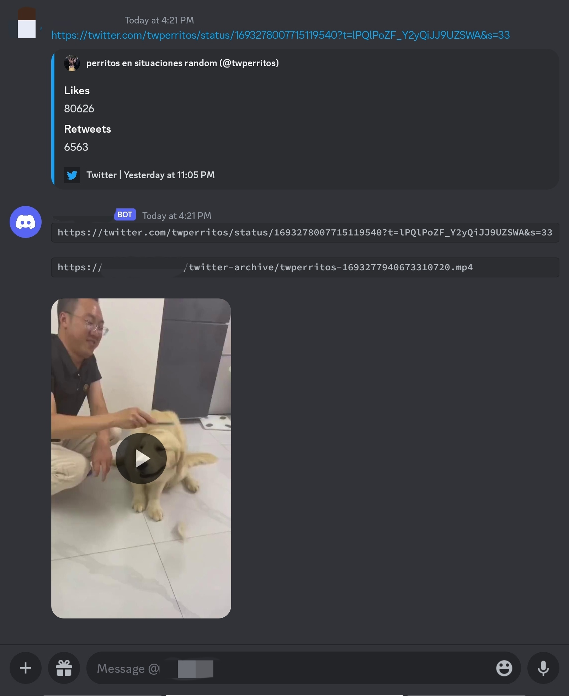

# Discord Twitter 视频下载机器人


[中文(中华人民共和国)文档(当前页面)] | [English Document](README_ENUS.md) | [Other language is working in progress](404.md)

该项目是一个 Discord 机器人，可以自动从私信中接收的 Twitter 链接下载视频。它使用 `yt-dlp`，一个用于从 Twitter.com 下载视频的 Python 库和命令行程序，从 Twitter 链接中获取视频。下载完成后，它会将文件上传到 S3 存储桶，并通过私信向您发送原始的 Twitter 链接和新的 S3 链接的消息。该消息还包含视频文件作为附件。

## 更新记录:

2023年-09月-10日: 因为现在X.com(Twitter)的App更改成会在分享复制链接时自动生成x.com的链接，所以也改成了识别x.com链接中视频。

## 功能

- 检测 Discord 消息中的 Twitter 链接，并自动下载关联的视频。
- 将下载的视频上传到 S3 存储桶。
- 通过 Discord 私信发送包含原始的 Twitter 链接、S3 链接和视频文件附件的消息。

## 在 RHEL-based Linux 发行版（Alma Linux 9）上的安装和使用

### 先决条件

- Python 3.6 或更高版本
- Discord API 令牌
- 兼容 S3 API 的块存储
- 已安装 `s3cmd`

### 步骤

1. 安装所需的 RPM 软件包：
   ```
   dnf install git python python-pip s3cmd -y
   ```

2. 克隆项目：
   ```
   git clone https://github.com/ZhaoKunqi/social-media-video-download-discord-bot.git
   ```

3. 进入项目目录：
   ```
   cd social-media-video-download-discord-bot
   ```

4. 安装所需的 Python 包：
   ```
   pip install -r requirements.txt
   ```

5. 配置 s3cmd：
   ```
   # 使用交互式配置方法
   s3cmd --configure
   # 或手动编辑配置文件
   vim /root/.s3cfg
   ```

   注意：
   ```
   host_base = {{在此处填写您的 S3 API 地址}}
   host_bucket = {{在此处留空，不推荐使用基于域名的 S3 API，除非您知道自己在做什么}}
   ```

6. 在您喜欢的文本编辑器中打开 `main.py`，并将以下占位符替换为您自己的信息：
   - `'Your-Discord-App-Token'`：用您的 Discord 机器人令牌替换。
   - `'Your-Bucket-Name'`：用您的 S3 存储桶名称替换。
   - `'Your-S3-Address'`：用您的 S3 存储桶地址替换。
   - `'cookies-twitter.txt'`：用您的 Twitter cookies 文件的路径替换。这对于 `yt-dlp` 能够从 Twitter 下载视频是必需的。
   - `'/root/discord/bot/downloads/'`：用您希望存储下载的视频的路径替换。

7. 运行机器人：
   ```
   python main.py
   ```

## 配置

要使用该机器人，您需要对 `main.py` 文件进行一些更改：

- 用您的 Discord 机器人令牌替换 `'Your-Discord-App-Token'`。
- 用您的 S3 存储桶名称和地址分别替换 `'Your-Bucket-Name'` 和 `'Your-S3-Address'`。
- 用您希望缓存下载的视频的路径替换 `'/root/discord/bot/downloads/'`。
- 用您的 Twitter cookies 文件的路径替换 `'cookies-twitter.txt'`。这对于 `yt-dlp` 能够从 Twitter 下载视频是必需的。

## 效果预览



## 贡献

如果您想为该项目做出贡献，请随时 fork 该存储库并提交拉取请求。我们也欢迎您遇到的任何问题。

## 许可证

该项目目前没有许可证，也没有计划添加许可证。
