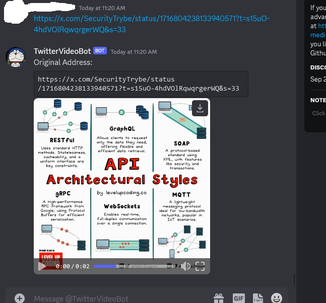
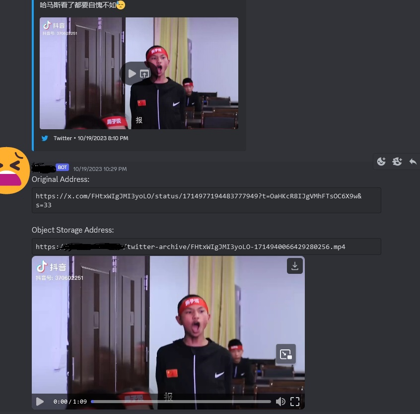
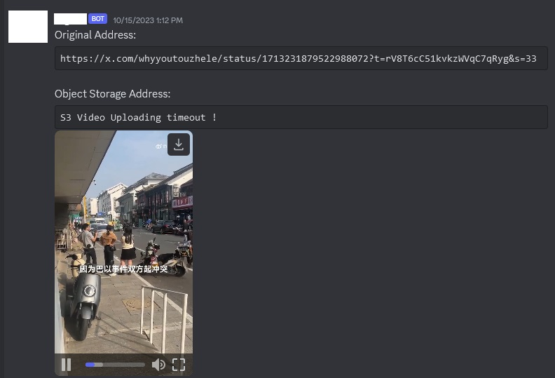

# Discord Twitter 视频下载机器人

[中文(中华人民共和国)文档(当前页面)] | [English Document](README_EN.md) | [日本語文档](README_JP.md)

本项目是一个 Discord 机器人，可以自动从私信中接收的 Twitter(x.com) 链接下载视频。

它使用 `yt-dlp`，一个用于从 x.com 下载视频的 Python 库和命令行程序，从 Twitter 链接中获取视频。

下载完成后，它会将文件上传到 S3 存储桶，并通过私信向您发送原始的 Twitter 链接和新的 S3 链接的消息。该消息还包含视频文件作为附件。

## 功能

- 检测 Discord 消息中的 Twitter 链接，并自动下载关联的视频。
- 将下载的视频上传到 S3 存储桶。
- 通过 Discord 私信发送包含原始的 Twitter 链接、S3 链接和视频文件附件的消息。

## 直接使用

目前提供一个不带S3备份功能的公开Bot, 可以免费使用, 当前频率限制为: 每个Discord账号/60个视频/每小时

机器人链接(无需权限): https://discord.com/api/oauth2/authorize?client_id=1153911158730928128&permissions=0&scope=bot

随便加进来私聊发给他推特链接(x.com的)即可使用

## 自己部署(systemd方式)

在 RHEL-based Linux 发行版上的安装和使用

这里使用Alma Linux 9

### 前置条件

- Python 3.6 或更高版本
- Discord API 令牌
- 兼容 S3 API 的对象存储服务(如果没有，则要在配置文件里将enable-s3-backup设置为False)

### 步骤

1. 安装所需的 RPM 软件包：
   ```
   dnf install git python python-pip -y
   ```

2. 克隆项目：
   ```
   git clone https://github.com/ZhaoKunqi/social-media-video-download-discord-bot.git
   ```

3. 进入项目目录：
   ```
   cd social-media-video-download-discord-bot
   ```

4. 安装所需的 Python 包：
   ```
   pip install -r requirements.txt
   ```
   
5. 配置

  要使用该机器人，您需要对 config.yml 文件进行一些更改。

- `discord-bot-token`：您的 Discord 机器人使用的令牌
- `cache-directory`：缓存视频的目录
- `cache-clean`：在上传到 Discord 和 S3（如果启用）之后是否删除视频缓存
- `x-cookie`：指定 X.com 的 cookie 文件
- `enable-s3-backup`：是否启用 S3 备份。如果为 false，则其他 S3 配置将不会生效
- `s3-endpoint`：S3 API 服务器地址
- `s3-access-front-end`：S3前端地址,会出现在发送给用户的消息中
- `s3-access-key` 和 `s3-secret-key`：S3 服务器验证的密钥
- `s3-bucket-name`：Bucket 名称（必须提前创建好，并且您需要有访问权限）
- `s3-upload-timeout`：S3上传超时限制(秒)

7. 运行机器人：
   ```
   python3 main.py
   ```

8. 使用systemd托管作为服务来运行

   ```
   cp discord-bot.service /etc/systemd/system/
   # 您需要修改对应的目录
   vim /etc/systemd/system/discord-bot.service

   systemctl daemon-reload
   systemctl enable /etc/systemd/system/discord-bot.service --now
   ```
   
### 备份策略相关配置文件的说明

在前置条件中有提到需要兼容S3 API的对象存储服务

如果没有兼容S3 API的对象存储服务，请将配置文件中的enable-s3-backup改为false,

在关闭S3备份的情况下，如果您的机器人服务端上有足够的磁盘空间并且您希望将下载的视频也备份到服务器上，您可以将配置文件中的cache-clean设为false，这样机器人就不会自动删除缓存的视频文件，您可以在cache-directory指定的缓存路径中找到您下载过的全部视频文件。

如果您不想启动S3备份并且服务器上没有足够的硬盘空间，请将配置文件中的enable-s3-backup改为false,并且保持cache-clean为true，这样机器人只会在Discord私聊频道里上传您需要的视频文件给您。

## 效果预览

### 效果：不启用S3备份，正常上传



### 效果：启用S3备份，正常备份到S3服务器

启用S3备份，正常备份到S3服务器以后会返回Discord对象存储和自定义S3备份服务器的地址



### 效果：启用S3备份，但无法备份到S3服务器

启用S3备份，但S3服务器上传超时将仅返回视频，并且告知连接错误



## 更新记录:

2023年-12月-30日: 为README.md增加了更多的备份策略相关配置文件的说明。

2023年-10月-26日: 为README.md添加了三张效果预览图，更新英语文档，添加日语文档。

2023年-09月-26日: 优化S3同步功能,添加超时功能,为config.yaml添加新配置项`s3-upload-timeout` , 修复了在S3服务器连接不畅时无法给用户返回视频的问题, 增加了稳定性.

2023年-09月-20日: 改进配置文件格式，添加更多自定义选项，更新文档

2023年-09月-10日: 因为现在X.com(Twitter)的App更改成会在分享复制链接时自动生成x.com的链接，所以也改成了识别x.com链接中视频。

## 贡献

如果您想为该项目做出贡献，请随时 fork 该存储库并提交拉取请求。我们也欢迎您遇到的任何问题。

## 许可证

本项目采用 MIT 许可证。有关详细信息，请参阅 LICENSE 文件。
