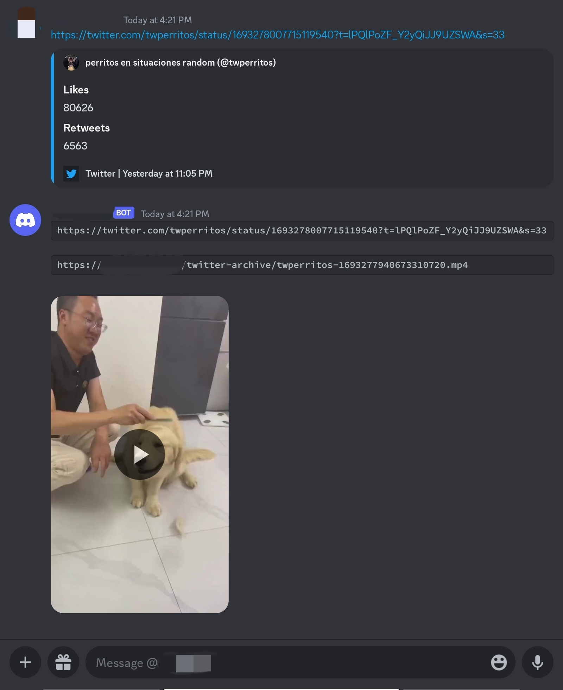

# Discord Twitter Video Download Bot 

[English Document (Current Page)] | [中文文档(中华人民共和国)](README.md) | [日本語文档](README_JP.md)

This project is a Discord bot that can automatically download videos from Twitter (x.com) links received in DMs.

It uses `yt-dlp`, a Python library and command line program for downloading videos from x.com links, to get videos from Twitter links. 

After download, it will upload the files to an S3 bucket and send you a DM with the original Twitter link, new S3 link, and the video file as an attachment.

## Features

- Detects Twitter links in Discord messages and automatically downloads associated videos.
- Uploads downloaded videos to an S3 bucket. 
- Sends a DM containing the original Twitter link, S3 link, and video file attachment.

## Direct Usage

Currently a public bot is provided without S3 backup function, which can be used for free. The current rate limit is 60 videos per hour per Discord account.

Bot invite link (no permission needed): https://discord.com/api/oauth2/authorize?client_id=1153911158730928128&permissions=0&scope=bot

Just add it to any server and DM it with x.com (Twitter) links.

## Self-hosting (systemd)

Installation and usage on RHEL-based Linux distributions

Alma Linux 9 is used here

### Prerequisites

- Python 3.6 or higher
- Discord bot token 
- S3 compatible object storage (optional, set `enable-s3-backup` to False in config if not available)

### Steps

1. Install required RPM packages:
   ```
   dnf install git python python-pip -y
   ```

2. Clone the project:
   ```
   git clone https://github.com/ZhaoKunqi/social-media-video-download-discord-bot.git
   ```

3. Enter the project directory:
   ```
   cd social-media-video-download-discord-bot
   ```

4. Install required Python packages:
   ```
   pip install -r requirements.txt
   ```
   
5. Configure the bot

  You'll need to make some changes to the config.yml file to use the bot.

- `discord-bot-token`: The token used by your Discord bot 
- `cache-directory`: Directory to cache downloaded videos
- `cache-clean`: Whether to delete video cache after uploading to Discord and S3 (if enabled)
- `x-cookie`: Cookie file to use for x.com
- `enable-s3-backup`: Whether to enable S3 backup. Other S3 configs will be ignored if this is false.
- `s3-endpoint`: S3 API server address  
- `s3-access-front-end`: S3 front-end address, will appear in messages sent to users
- `s3-access-key` and `s3-secret-key`: Keys for S3 server authentication
- `s3-bucket-name`: Bucket name (must exist and you need access)
- `s3-upload-timeout`: S3 upload timeout limit (seconds)

7. Run the bot:
   ```
   python3 main.py
   ```

8. Use systemd to run it as a service

   ```
   cp discord-bot.service /etc/systemd/system/
   # Modify the path as needed
   vim /etc/systemd/system/discord-bot.service

   systemctl daemon-reload
   systemctl enable /etc/systemd/system/discord-bot.service --now
   ```

## Preview



## Changelog

2023-09-26: Optimized S3 sync, added timeout, added new config `s3-upload-timeout`, fixed issue with failing to return videos when S3 has connectivity issues, improved reliability.

2023-09-20: Improved config file format, added more customization options, updated docs

2023-09-10: Adapted to also detect videos from x.com links as now x.com links are automatically generated when sharing Twitter links from app.

## Contributing

Feel free to fork this repository and submit pull requests if you would like to contribute. Issues are also welcome! 

## License

This project is under the MIT License. See the LICENSE file for details.
