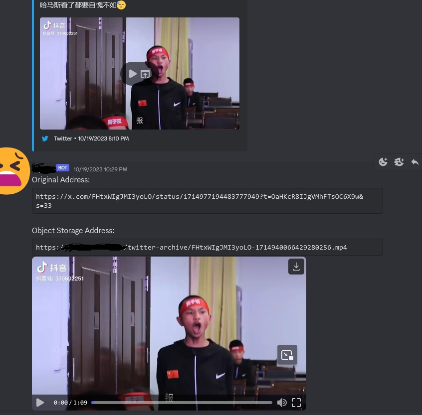

# Discord Twitter Video Download Bot

[中文(中华人民共和国)文档(Chinese Document)](README.md) | [English Document(Current Page)] | [日本語文档(Japanese Document)](README_JP.md)

This project is a Discord bot that automatically downloads videos from Twitter (x.com) links received in direct messages.

It uses `yt-dlp`, a Python library and command-line program for downloading videos from x.com, to fetch videos from Twitter links.

After downloading, it uploads the file to an S3 bucket and sends you a message via direct message with the original Twitter link and the new S3 link. The message also includes the video file as an attachment.

## Features

-   Detects Twitter links in Discord messages and automatically downloads the associated videos.
-   Uploads downloaded videos to an S3 bucket.
-   Sends a message via Discord direct message containing the original Twitter link, S3 link, and video file attachment.

## Public Bot (Direct Use)

Currently, a public bot without S3 backup functionality is available for free use.  The current rate limit is: 60 videos / 24 hours per Discord account.

Bot link (no permissions required): https://discord.com/api/oauth2/authorize?client_id=1153911158730928128&permissions=0&scope=bot

Just add it and send it Twitter links (x.com or twitter.com links) in a direct message.

## Self-Deployment (systemd method)

Installation and usage on RHEL-based Linux distributions.

This example uses Alma Linux 9.

### Prerequisites

-   Python 3.6 or higher
-   Discord API token
-   S3 API-compatible object storage service (if not available, set `enable-s3-backup` to `False` in the configuration file)

### Steps

1.  Install required RPM packages:
    ```
    dnf install git python python-pip -y
    ```

2.  Clone the project:
    ```
    git clone [https://github.com/ZhaoKunqi/social-media-video-download-discord-bot.git](https://github.com/ZhaoKunqi/social-media-video-download-discord-bot.git)
    ```

3.  Navigate to the project directory:
    ```
    cd social-media-video-download-discord-bot
    ```

4.  Install required Python packages:
    ```
    pip install -r requirements.txt
    ```

5.  Configuration

    To use the bot, you need to make some changes to the `config.yml` file.

    -   `discord-bot-token`: The token used by your Discord bot.
    -   `cache-directory`: The directory to cache videos.
    -   `cache-clean`: Whether to delete video cache after uploading to Discord and S3 (if enabled).
    -   `x-cookie`: Specify the cookie file for X.com.
    -   `enable-s3-backup`: Whether to enable S3 backup. If false, other S3 configurations will not take effect.
    -   `s3-endpoint`: S3 API server address.
    -   `s3-access-front-end`: S3 front-end address, which will appear in the message sent to the user.
    -   `s3-access-key` and `s3-secret-key`: Keys for S3 server authentication.
    -   `s3-bucket-name`: Bucket name (must be created in advance, and you need access).
    - `s3-upload-timeout`: S3 upload timeout limit (seconds).

6.  Run the bot:
    ```
    python3 main.py
    ```

7.  Run as a service using systemd:

    ```
    cp discord-bot.service /etc/systemd/system/
    # You need to modify the corresponding directory
    vim /etc/systemd/system/discord-bot.service

    systemctl daemon-reload
    systemctl enable /etc/systemd/system/discord-bot.service --now
    ```

### Explanation of Configuration Files Related to Backup Strategy

The prerequisites mention the need for an S3 API-compatible object storage service.

If you do not have an S3 API-compatible object storage service, please change `enable-s3-backup` to `false` in the configuration file.

If S3 backup is turned off, and you have enough disk space on your bot server and you want to back up the downloaded videos to the server as well, you can set `cache-clean` to `false` in the configuration file. This way, the bot will not automatically delete the cached video files, and you can find all the downloaded videos in the cache path specified by `cache-directory`.

If you do not want to enable S3 backup and do not have enough hard disk space on the server, please change `enable-s3-backup` to `false` and keep `cache-clean` as `true`. This way, the bot will only upload the video files you need to the Discord direct message channel.

## Preview

### Effect: S3 backup is not enabled, normal upload


### Effect: S3 backup is enabled, normal backup to S3 server

After enabling S3 backup and successfully backing up to the S3 server, it will return the addresses of the Discord object storage and the custom S3 backup server.



### Effect: S3 backup is enabled, but cannot be backed up to the S3 server

Enabling S3 backup, but the S3 server upload timeout will only return the video and report a connection error.


## Update History:

2024-05-21: Fixed the issue where 'x.com' was not recognized after the yt-dlp library updated the extractor.

2023-12-31: Changed to recognize both 'x.com' and 'twitter.com' links due to recent changes made by Twitter.

2023-12-30: Added more explanations of configuration files related to backup strategy to README.md.

2023-10-26: Added three preview images to README.md, updated English documentation, and added Japanese documentation.

2023-09-26: Optimized S3 synchronization function, added timeout function, added a new configuration item `s3-upload-timeout` to config.yaml, fixed the problem that the video could not be returned to the user when the S3 server connection was poor, and improved stability.

2023-09-20: Improved configuration file format, added more customization options, updated documentation.

2023-09-10: Because the X.com (Twitter) App has now been changed to automatically generate x.com links when sharing copy links, it has also been changed to recognize videos in x.com links.

## Contributing

If you want to contribute to this project, please feel free to fork the repository and submit a pull request. We also welcome any issues you encounter.

## License

This project is licensed under the MIT License. See the LICENSE file for details.
